<h1 align="center"><strong>Project: Website quản lý công việc</strong></h1>

<h2>Thông tin cá nhân</h2>

👤 **Họ tên:** Nguyễn Hà Nguyên  
🎓 **Mã sinh viên:** 23010310

# Sơ đồ khối

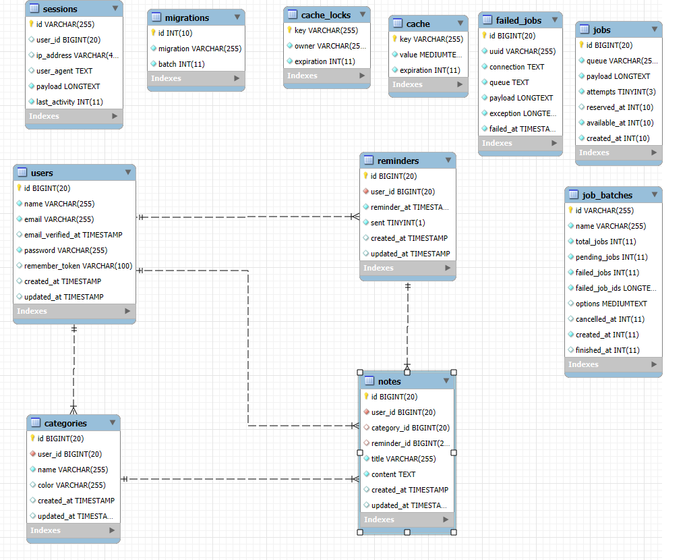

## Sơ đồ chức năng

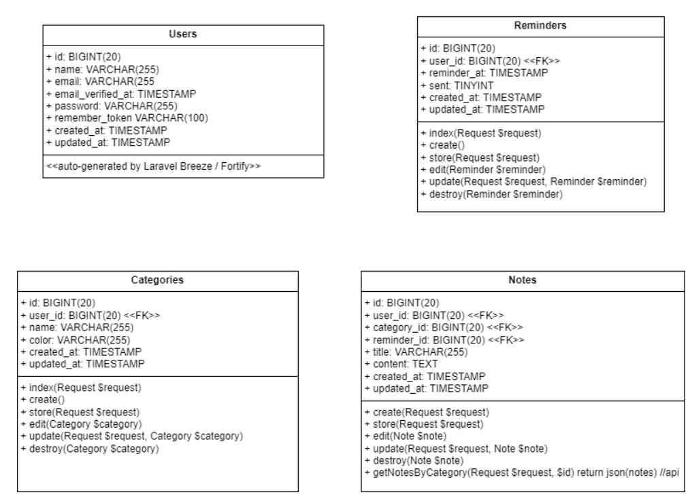

## Sơ đồ thuật toán

Dasboard
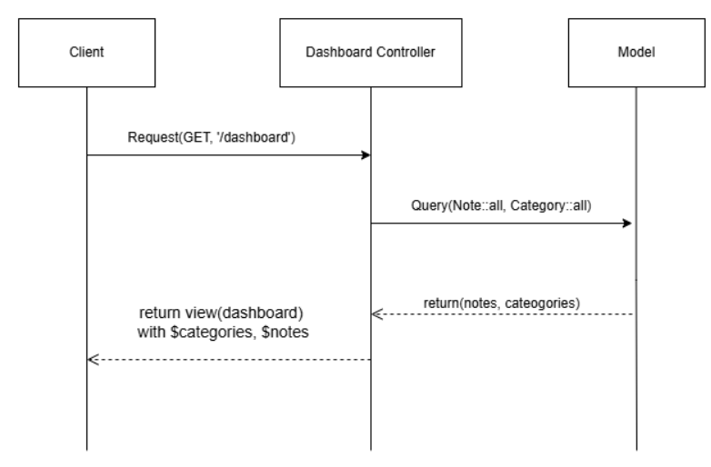

Centralized error handling
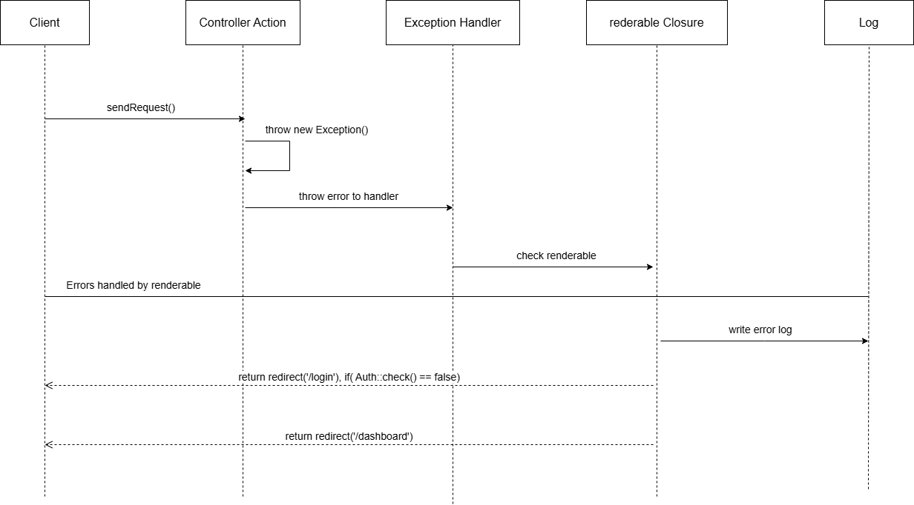

Send note reminders via email
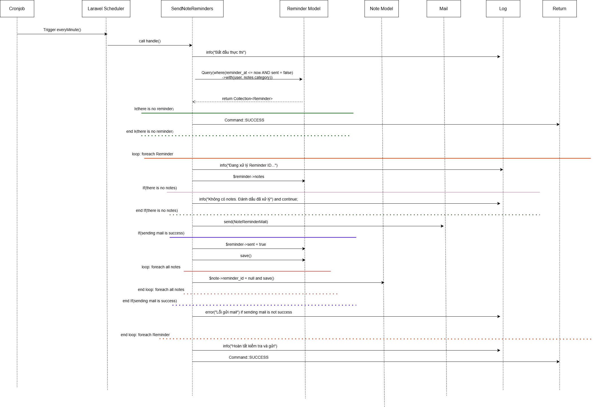

CRUD Note
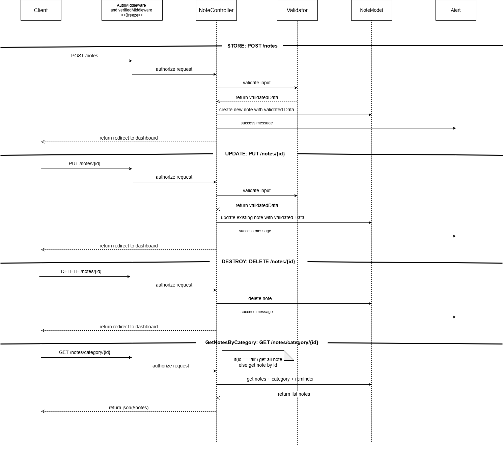

CRUD Category  
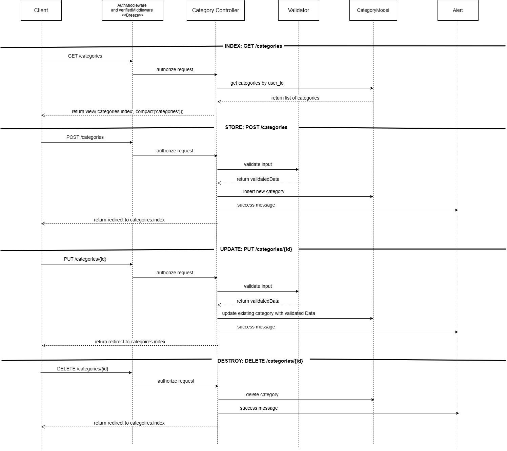

CRUD Reminder
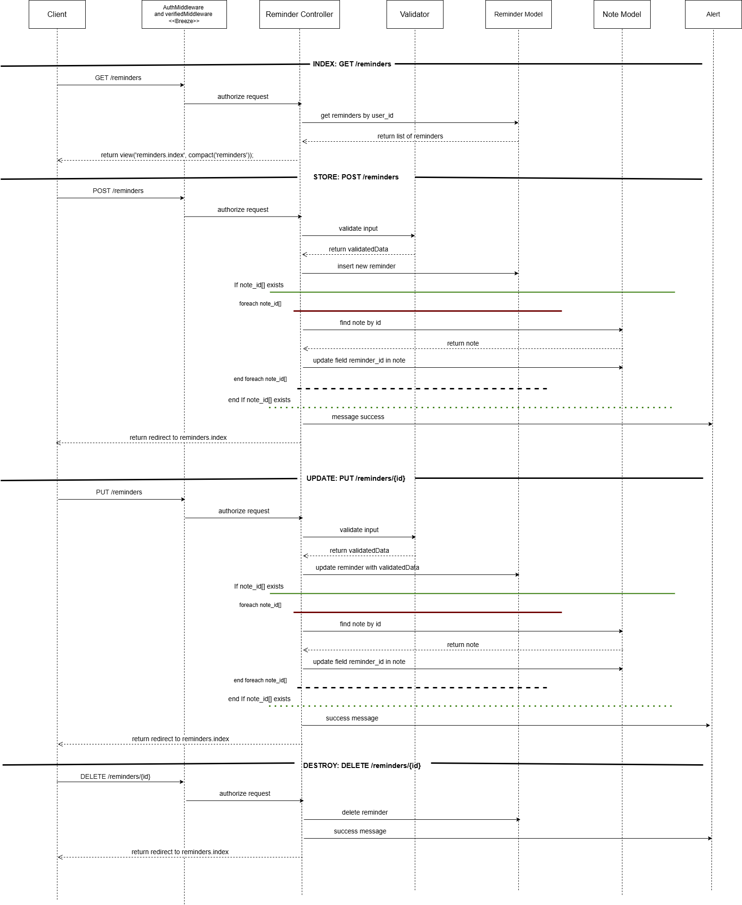

<!--
Edit Cart
Activity Diagram

Delete Cart

Activity Diagram

Authentication/Authorisation -->

# Một số Code chính minh họa

## Model

Note Model

```php
class Note extends Model
{
    protected $fillable = ['title', 'content', 'user_id', 'category_id', 'reminder_id'];

    public function user()
    {
        return $this->belongsTo(User::class);
    }

    public function category()
    {
        return $this->belongsTo(Category::class);
    }

    public function reminder()
    {
        return $this->belongsTo(Reminder::class);
    }
}

```

Category Model

```php
class Category extends Model
{
    protected $fillable = ['name', 'color', 'user_id'];

    public function user()
    {
        return $this->belongsTo(User::class);
    }

    public function notes()
    {
        return $this->hasMany(Note::class);
    }
}

```

Reminder Model

```php
class Reminder extends Model
{
    protected $fillable = ['reminder_at', 'sent', 'user_id'];
    protected $casts = [
        'reminder_at' => 'datetime',
        'sent'        => 'boolean',
    ];

    public function user()
    {
        return $this->belongsTo(User::class);
    }

    public function notes()
    {
        return $this->hasMany(Note::class);
    }
}

```

## Controller

Note Controller

```php
    //Read
    public function getNotesByCategory(Request $request, $id) {//api
        $user = $request->user();
        if($id == 'all') {
            $notes = Note::where('user_id', $user->id)
                     ->with('category')
                     ->with('reminder')
                     ->get();
        } else {
             $notes = Note::where('user_id', $user->id)
                     ->where('category_id', $id)
                     ->with('category')
                     ->with('reminder')
                     ->get();
        }
        return response()->json($notes);
    }

    //Create
    public function store(Request $request)
    {
        try {
            $validatedData = $request->validate([
                'title' => 'required|string|max:255',
                'content' => 'required|string',
                'category_id' => 'nullable|integer|exists:categories,id',
                'reminder_id' => 'nullable|integer|exists:reminders,id',
            ]);

            $note = new Note();
            $note->title = $validatedData['title'];
            $note->content = $validatedData['content'];
            $note->category_id = $validatedData['category_id'] ?? null;
            $note->reminder_id = $validatedData['reminder_id'] ?? null;

            $note->user_id = Auth::id();


            $note->save();
            Alert::success('success', 'Note created successfully!');

            return redirect()->route('dashboard');
        } catch (\Exception $e) {
            throw $e;
        }
    }

    //Update
    public function update(Request $request, Note $note)
    {
        try {
            $validatedData = $request->validate([
                'title' => [
                    'required',
                    'string',
                    'max:255'
                ],
                'content' => 'required|string',
                'category_id' => 'nullable|integer|exists:categories,id',
                'reminder_id' => 'nullable|integer|exists:reminders,id',
            ]);

            // 2. Cập nhật các thuộc tính của ghi chú
            $note->title = $validatedData['title'];
            $note->content = $validatedData['content'];
            $note->category_id = $validatedData['category_id'];
            $note->reminder_id = $validatedData['reminder_id'];

            $note->save();

            Alert::success('Success', 'Note has been updated successfully!');

            return redirect()->route('dashboard');
        } catch (\Exception $e) {
            throw $e;
        }
    }

    //Delete
    public function destroy(Note $note)
    {
        try {
            $note->delete();

            Alert::success('Success', 'Note deleted successfully!');

            return redirect()->route('dashboard');
        } catch (\Exception $e) {
            throw $e;
        }
    }
```

Category Controller

```php
    //Read
    public function index(Request $request)
    {
        try {
            $user = $request->user();
            $categories = Category::where('user_id', $user->id)->get();
            return view('categories.index', compact('categories'));
        } catch (\Exception $e) {
            throw $e;
        }
    }

    //Create
    public function store(Request $request)
    {
        try {
            $validatedData = $request->validate([
                'name' => 'required|string|max:255',
                'color' => 'required|string',
            ]);

            $category = new Category();
            $category->name = $validatedData['name'];
            $category->color = $validatedData['color'];
            $category->user_id = Auth::id();

            $category->save();

            Alert::success('Success', 'Category created successfully!');
            return redirect()->route('categories.index');
        } catch (\Exception $e) {
            throw $e;
        }
    }

    //Update
    public function update(Request $request, Category $category)
    {
        try {
            $validatedData = $request->validate([
                'name' => 'required|string|max:255',
                'color' => 'required|string',
            ]);

            $category->name = $validatedData['name'];
            $category->color = $validatedData['color'];

            $category->save();

            Alert::success('Success', 'Category has been updated successfully!');

            return redirect()->route('categories.index');
        } catch (\Exception $e) {
            throw $e;
        }
    }

    //Delete
    public function destroy(Category $category)
    {
        try {
            $category->delete();

            Alert::success('Success', 'Category deleted successfully!');
            return redirect()->route('categories.index');
        } catch (\Exception $e) {
            throw $e;
        }
    }
```

Reminder Controller

```php
    //Read
    public function index(Request $request)
    {
        try {
            $user = $request->user();
            $reminders = Reminder::where('user_id', $user->id)->get();
            return view('reminders.index', compact('reminders'));
        } catch (\Exception $e) {
            throw $e;
        }
    }

    //Create
    public function store(Request $request)
    {
        try {
            $validatedData = $request->validate([
                'reminder_at' => 'required|date',
                 'note_id' => 'nullable|array',
                 'note_id.*' => 'exists:notes,id',
            ]);


            $reminder = new Reminder();
            $reminder->reminder_at = $validatedData['reminder_at'];
            $reminder->sent = false;
            $reminder->user_id = Auth::id();

            $reminder->save();

            if (!empty($validatedData['note_id'])) {
                foreach ($validatedData['note_id'] as $noteId) {
                    $note = Note::find($noteId);
                    if ($note) {
                        $note->reminder_id = $reminder->id;
                        $note->save();
                    }
                }
            }

            Alert::success('Success', 'Reminder created successfully!');
            return redirect()->route('reminders.index');
        } catch (\Exception $e) {
            throw $e;
        }
    }

    //Update
    public function update(Request $request, Reminder $reminder)
    {
        try {
            $validatedData = $request->validate([
                'reminder_at' => 'required|date',
                'note_id' => 'nullable|array',
                'note_id.*' => 'exists:notes,id',
                'sent' => 'nullable|boolean'
            ]);

           $reminder->reminder_at = $validatedData['reminder_at'];

            $reminder->sent = $request->has('sent');

           if (!empty($validatedData['note_id'])) {
                foreach ($validatedData['note_id'] as $noteId) {
                    $note = Note::find($noteId);
                    if ($note) {
                        $note->reminder_id = $reminder->id;
                        $note->save();
                    }
                }
            }

           $reminder->save();


           Alert::success('Success', 'Reminder updated successfully!');
           return redirect()->route('reminders.index');
        } catch (\Exception $e) {
            throw $e;
        }
    }

    //Delete
    public function destroy(Reminder $reminder)
    {
        try {
            $reminder->delete();

            Alert::success('Success', 'Reminder deleted successfully!');

            return redirect()->route('reminders.index');
        } catch (\Exception $e) {
            throw $e;
        }
    }
```

SendNoteReminder

```php
    file:app/console/Commands/SendNoteReminders.php
    class SendNoteReminders extends Command
{
    /**
     * The name and signature of the console command.
     *
     * @var string
     */
    protected $signature = 'reminders:send-notes';

    /**
     * The console command description.
     *
     * @var string
     */
        protected $description = 'Kiểm tra và gửi email nhắc nhở (tổng hợp cho user của reminder) đến hạn';

    /**
     * Execute the console command.
     *
     * @return int
     */
    public function handle()
    {
        Log::info('SendNoteReminders Command: Bắt đầu thực thi.');
        $now = Carbon::now();

        $dueReminders = Reminder::with([
            'user',
            'notes.category' // Tải các notes và category của từng note
        ])->where('reminder_at', '<=', $now)
            ->where('sent', false)
            ->get();

        if ($dueReminders->isEmpty()) {
            return Command::SUCCESS;
        }

        foreach ($dueReminders as $reminder) {
            Log::info("SendNoteReminders Command: Đang xử lý Reminder ID: {$reminder->id} cho User ID: {$reminder->user->id} (Thời gian nhắc: {$reminder->reminder_at->toDateTimeString()})");

            // User nhận mail chính là $reminder->user
            $userToSendTo = $reminder->user;

            // Tất cả các notes của reminder này (đã có category)
            $allNotesForThisReminder = $reminder->notes;

            if ($allNotesForThisReminder->isEmpty()) {
                Log::info("SendNoteReminders Command: Reminder ID {$reminder->id} không có notes nào để gửi cho User ID {$userToSendTo->id}. Đánh dấu là đã xử lý.");
                continue; // Chuyển sang reminder tiếp theo
            }

            $emailSentSuccessfully = true;
            try {
                Mail::to($userToSendTo->email)->send(new NoteReminderMail($userToSendTo, $allNotesForThisReminder, $reminder));
            } catch (\Exception $e) {
                $emailSentSuccessfully = false;
            }

            if ($emailSentSuccessfully) {
                $reminder->sent = true; // Đánh dấu là đã gửi email thành công
                $reminder->save();

                foreach ($allNotesForThisReminder as $note) {
                    $note->reminder_id = null;
                    $note->save();
                }
            } else {
                Log::error("SendNoteReminders Command: Có lỗi xảy ra khi gửi email cho Reminder ID: {$reminder->id}. Nhắc nhở này sẽ được thử lại lần sau.");
            }
        }

        Log::info('SendNoteReminders Command: Hoàn tất việc kiểm tra và gửi nhắc nhở.');
        return Command::SUCCESS;
    }
}
```

## View

# Security Setup

Sử dụng @csrf để chống tấn công CSRF
Ví dụ: file reminder/create.blade.php
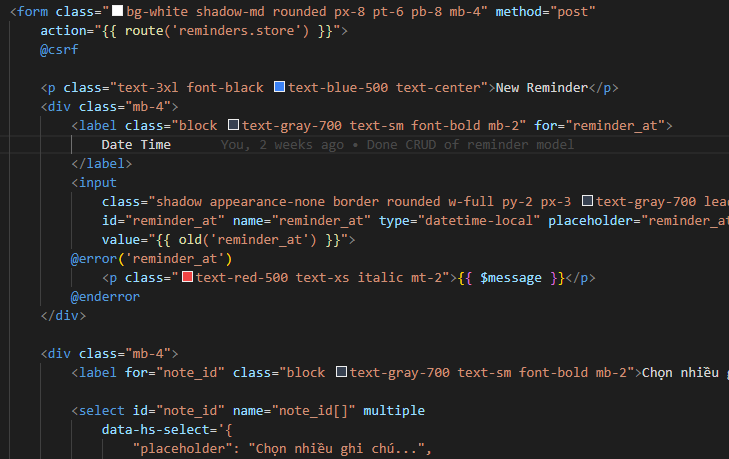

Chống tấn công XSS  
Ví dụ: file reminder/index.blade.php
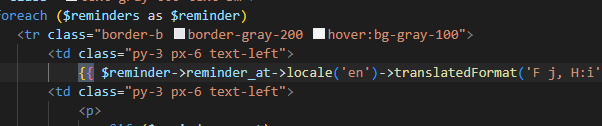

Validation Ràng buộc dữ liệu giúp ngăn chặn các input độc hại
Ví dụ method NoteController@store
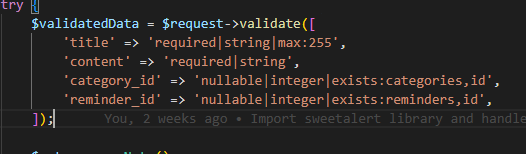

Query Builder Protection chống SQL Injection
Ví dụ method DashboardController@index
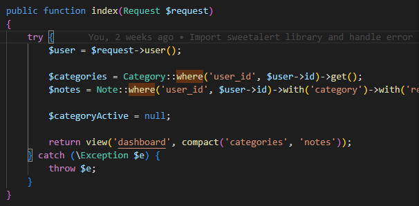

Middleware bảo mật
Xử dụng các middleware auth, verified, throttle của laravel
Ví dụ: file routes/web.php

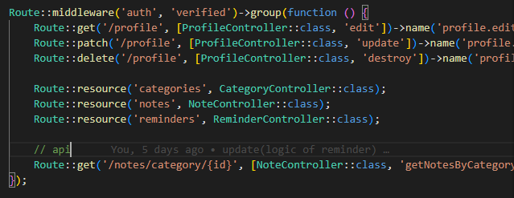

Authorization
Ví dụ: Sử dụng Gate để authorization người dùng chỉ được update đúng note của họ
method: NoteController@update
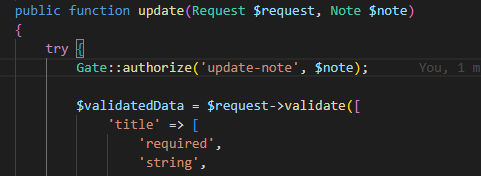

Authentication
Ví dụ: Sử dụng Auth() để lấy thông tin user 1 cách an toàn
method:CategoryController@store
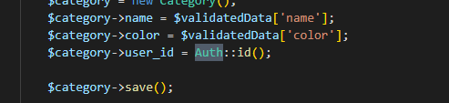

# Link

## Github link

`https://github.com/Nguyen1976/note_web_laravel`

## Github page

`https://nguyen1976.github.io/note_web_laravel/`

## Youtube link

`https://note-web-laravel-main-b8ncde.laravel.cloud/`

## Public Web (deployment) link

`https://note-web-laravel-main-b8ncde.laravel.cloud/`

# Một số hình ảnh chức năng chính

## Xác thực người dùng <\<Breeze>\>

Trang đăng nhập
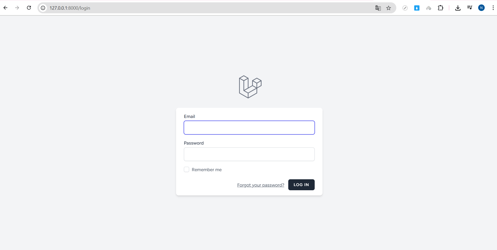

Trang đăng ký
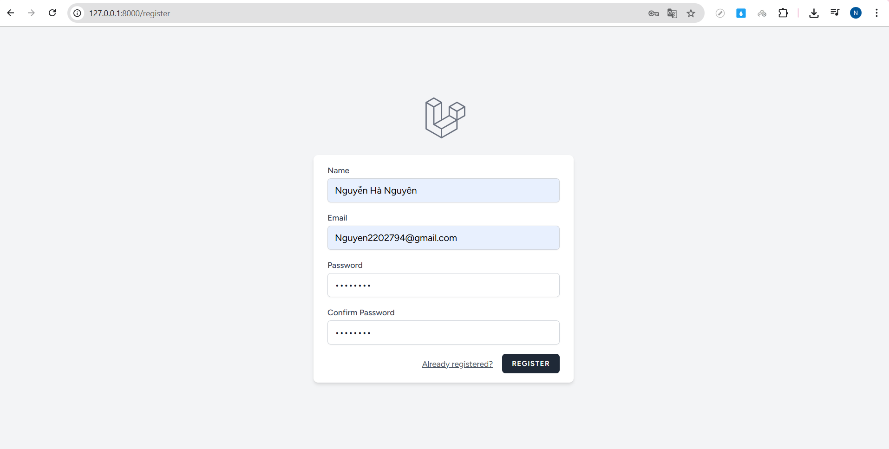

Gửi mail yêu cầu người dùng verified
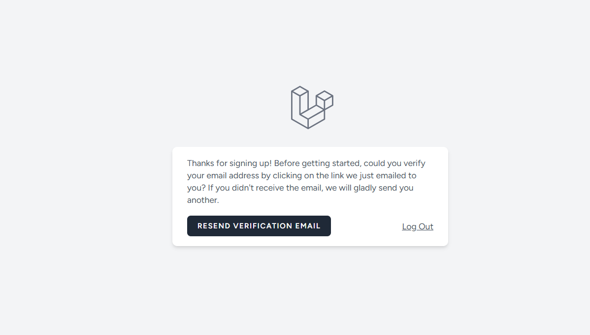
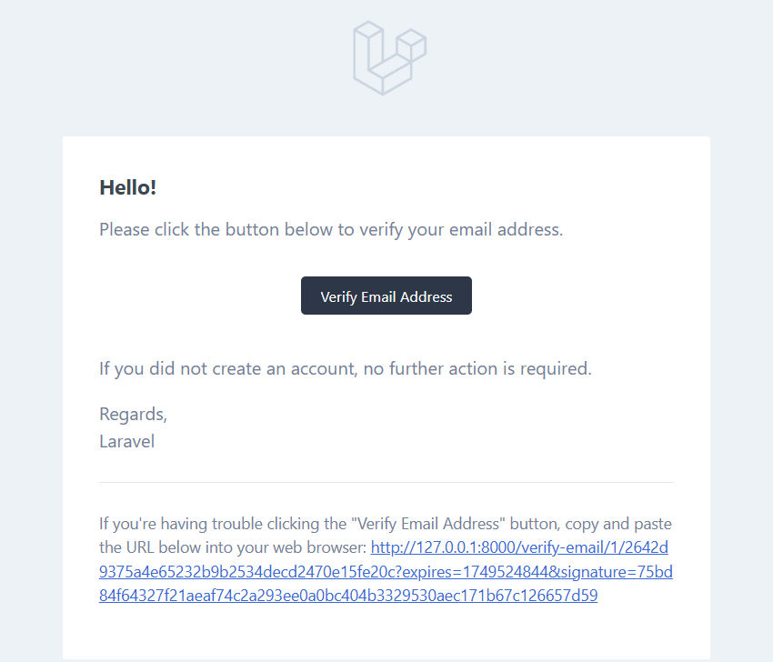

## Trang chính

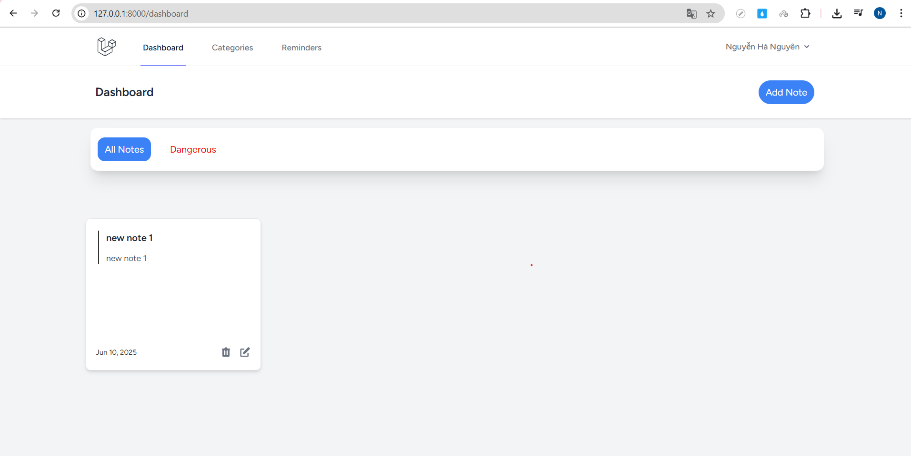

Lọc note theo category
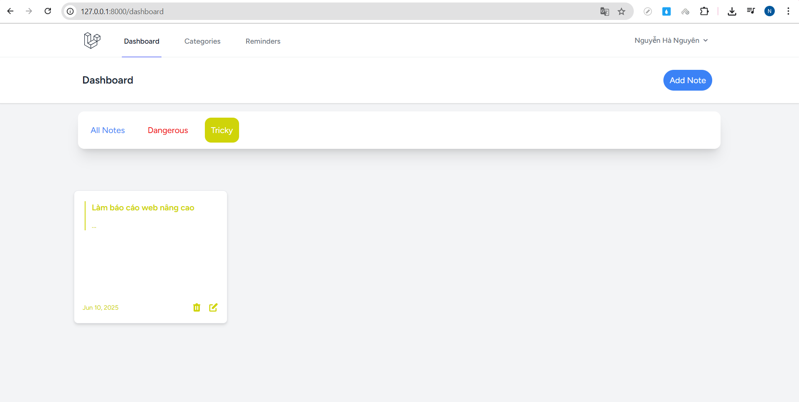

## CRUD Note

Create Note
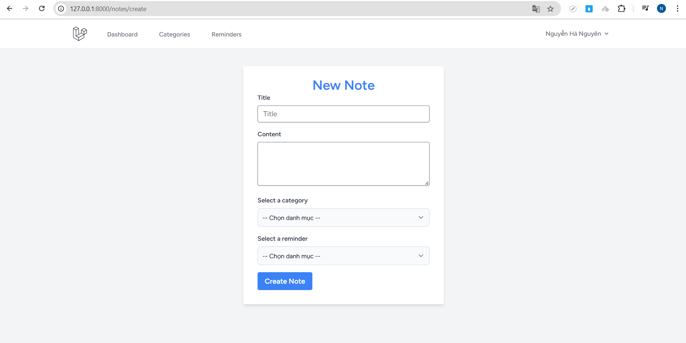

Delete and update note
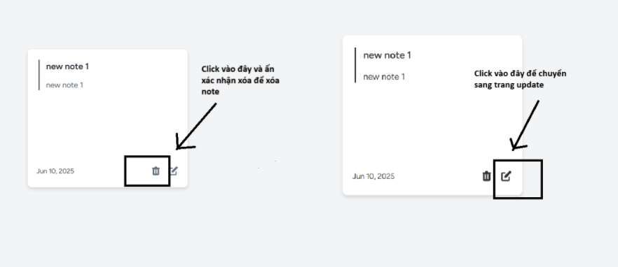

Trang update
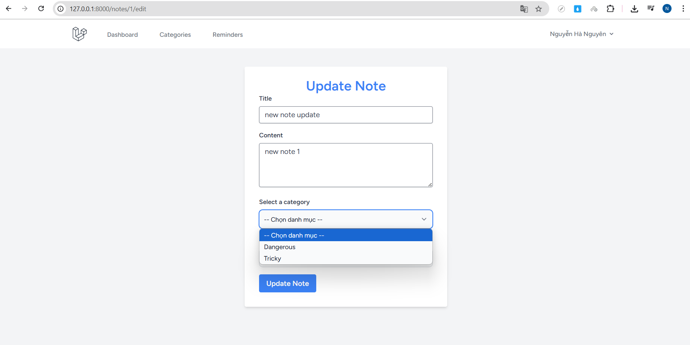

## CRUD Category

Trang chính
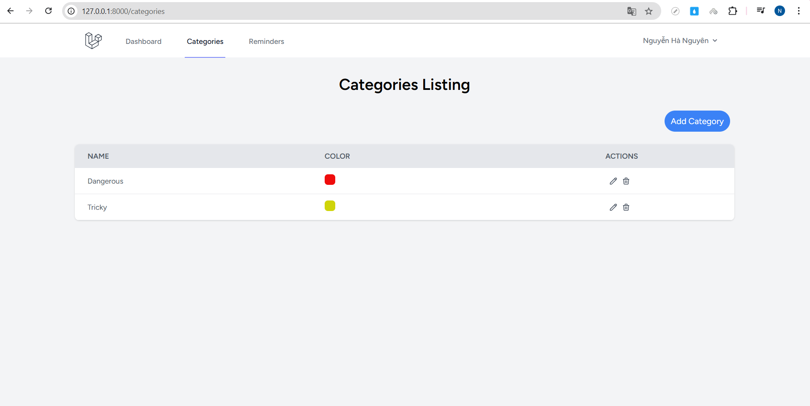

Create Category
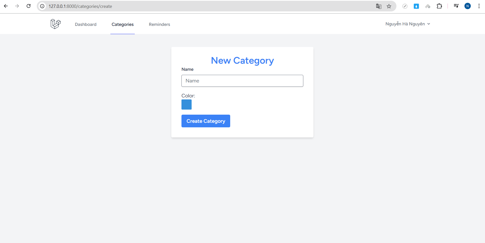

Delete and update category
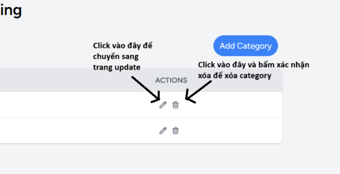

Trang update
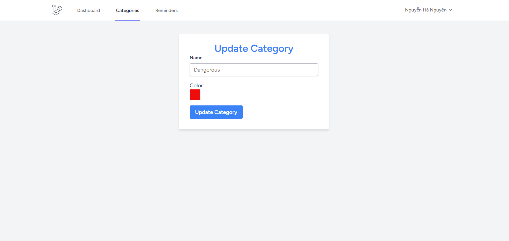

## CRUD Reminder

Trang chính


Create Reminder
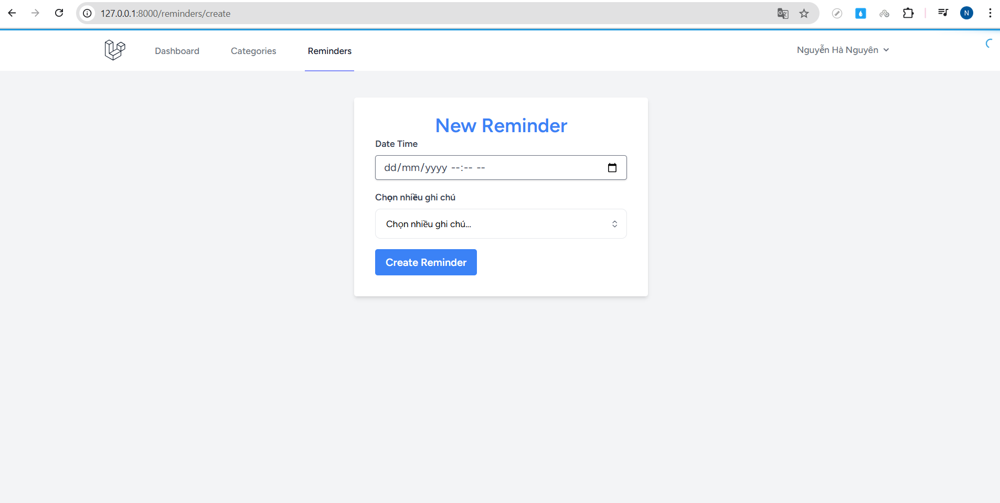

Delete and update reminder
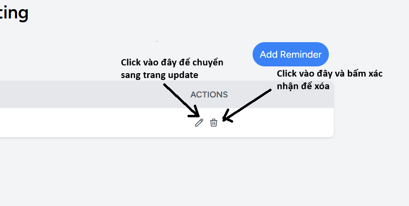

Trang update
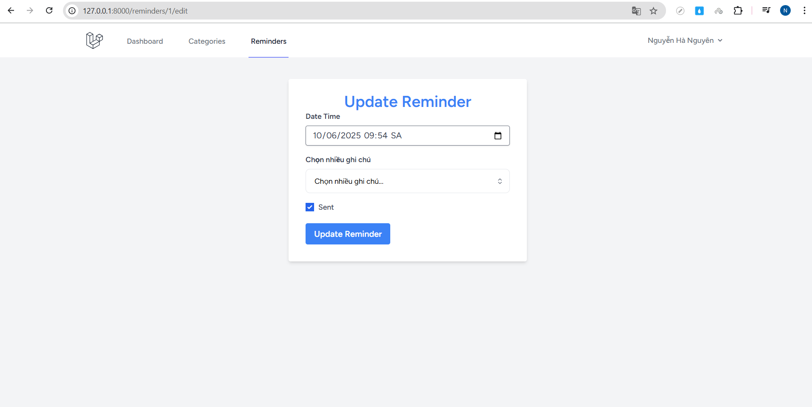

Gán reminder cho note để tạo nhắc nhớ cho note đó
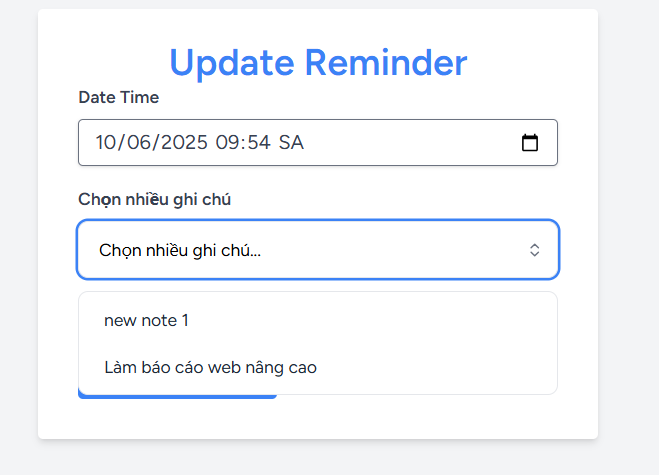
hoặc  
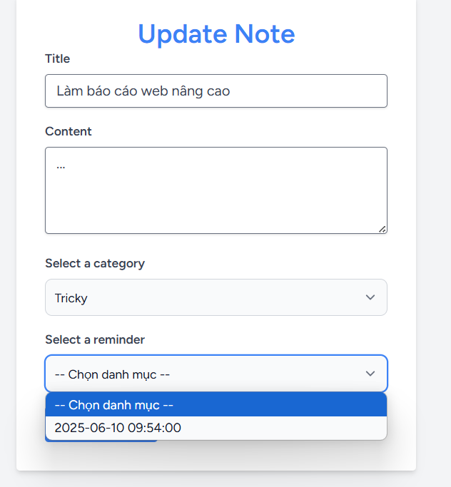

Khi một note được gán reminder mà đến thời gian reminder được nhắc nhở thì sẽ gửi mail nhắc nhở người dùng những note đến hạn  
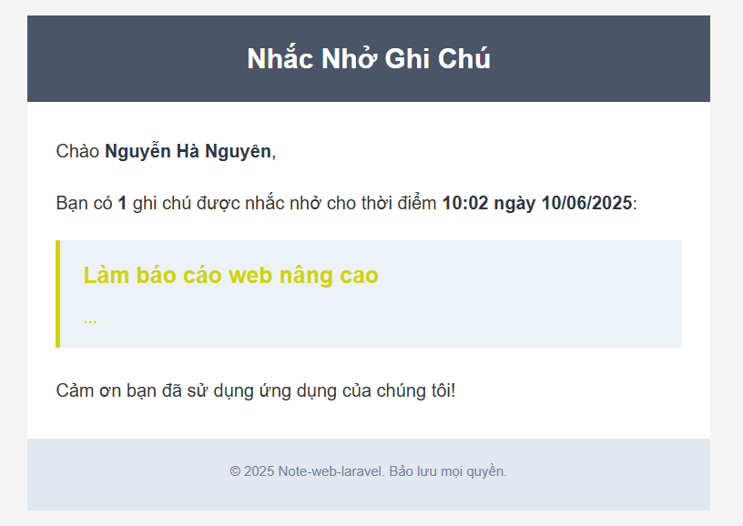

# License & Copy Rights

The Laravel framework is open-sourced software licensed under the [MIT license](https://opensource.org/licenses/MIT).
