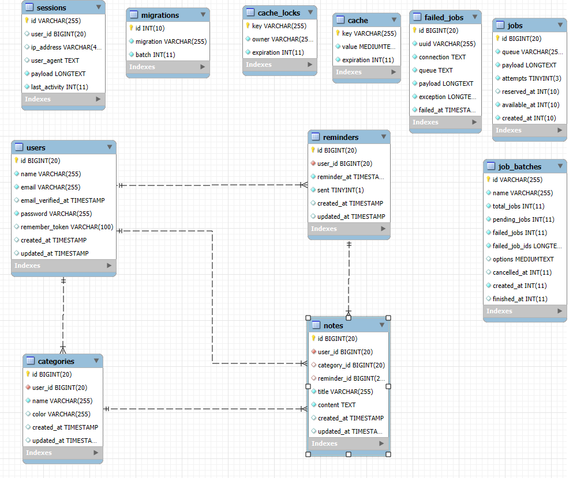

# Project: Website bán ô tô
Giới thiệu:

# Sơ đồ khối


## Sơ đồ chức năng


Class Diagram of Objects

## Sơ đồ thuật toán

Create Cart (user / car /user-car)
Activity Diagram

Edit Cart
Activity Diagram

Delete Cart

Activity Diagram

Authentication/Authorisation


# Một số Code chính minh họa

## Model
Cart
## Controller
Phương thức CRUD

## View
blade template Cart

# Security Setup

# Link
## Link Demo : Youtube link
## Public Web (deployment) link: 

# Một số hình ảnh chức năng chính


# License & Copy Rights

The Laravel framework is open-sourced software licensed under the [MIT license](https://opensource.org/licenses/MIT).


## Link demo
```
    https://note-web-laravel-main-b8ncde.laravel.cloud/
```

