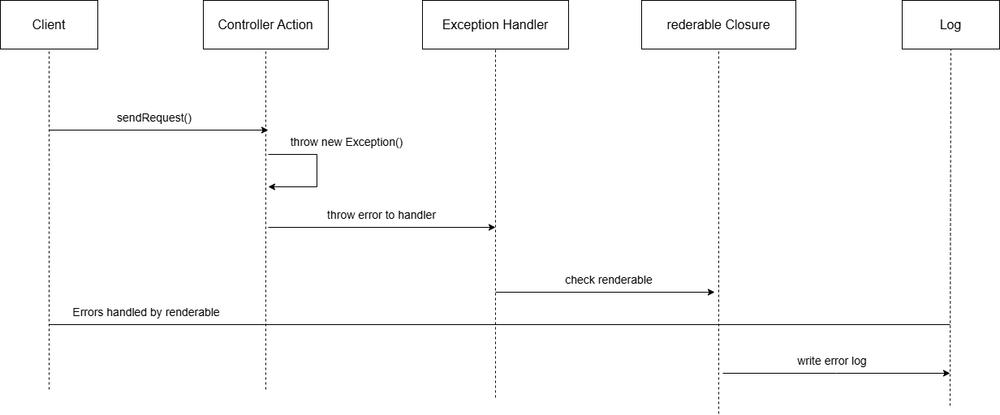
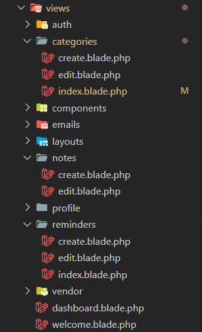
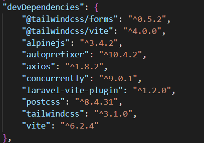
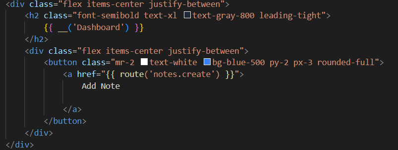
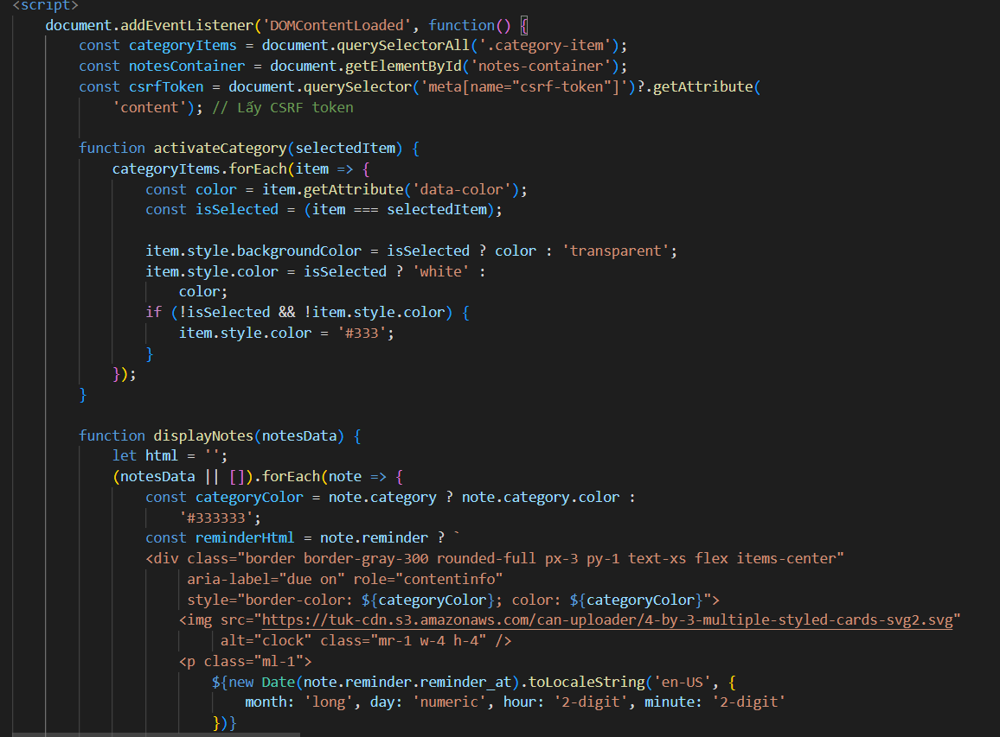
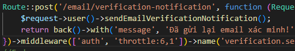
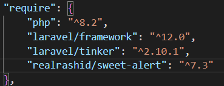
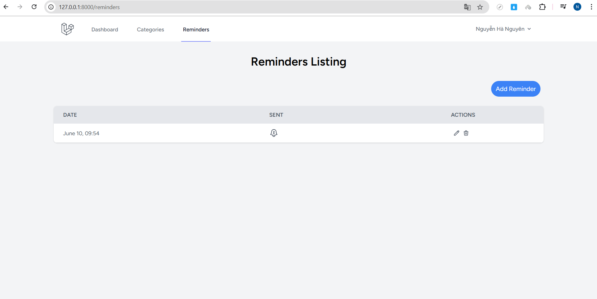

<h1 align="center"><strong>Project: Website quản lý công việc</strong>  </h1>

<h2>Thông tin cá nhân</h2>

👤 **Họ tên:** Nguyễn Hà Nguyên  
🎓 **Mã sinh viên:** 23010310

## 📝 Mô tả dự án

Website quản lý công việc cá nhân, cho phép người dùng tạo ghi chú, phân loại, đặt nhắc nhở và gửi email thông báo tự động.  
Dự án sử dụng Laravel, MySQL, và tích hợp hệ thống gửi mail định kỳ.

## 🧰 Công nghệ sử dụng

-   PHP (Laravel Framework)
-   AJAX (Asynchronous JavaScript and XML)
-   Laravel Breeze
-   MySQL (Aiven Cloud)
-   Blade Template
-   Tailwind CSS (do Breeze tích hợp sẵn)
-   Laravel Scheduler
-   Laravel Alert (SweetAlert)

## 🚀 Cài đặt & Chạy thử

```bash
git https://github.com/Nguyen1976/note_web_laravel
cd ./folder-project
composer install
npm i
cp .env.example .env
php artisan key:generate
php artisan migrate
```

<p>
Hãy tạo 1 server SQL trên aiven để có thể dùng trong dự án hoặc tự tạo 1 server với xampp hoặc docker trên máy tính cá nhân của bạn  
</p>
<strong>
Sau dó chạy 3 câu lệnh ở 3 terminal khác nhau
</strong>

```bash
php artisan serve
npm run dev
php artisan schedule:work
```

# Sơ đồ khối


## ⚙️Sơ đồ chức năng


## 🧠Sơ đồ thuật toán

<strong>Dasboard</strong>  


<strong>Centralized error handling</strong>  


<strong>Send note reminders via email</strong>  


<strong>CRUD Note</strong>  


<strong>CRUD Category </strong>  


<strong>CRUD Reminder</strong>  


<!--
Edit Cart
Activity Diagram

Delete Cart

Activity Diagram

Authentication/Authorisation -->

# Một số Code chính minh họa

## Model

<strong>Note Model</strong>

```php
class Note extends Model
{
    protected $fillable = ['title', 'content', 'user_id', 'category_id', 'reminder_id'];

    public function user()
    {
        return $this->belongsTo(User::class);
    }

    public function category()
    {
        return $this->belongsTo(Category::class);
    }

    public function reminder()
    {
        return $this->belongsTo(Reminder::class);
    }
}

```

<strong>Category Model</strong>

```php
class Category extends Model
{
    protected $fillable = ['name', 'color', 'user_id'];

    public function user()
    {
        return $this->belongsTo(User::class);
    }

    public function notes()
    {
        return $this->hasMany(Note::class);
    }
}

```

<strong>Reminder Model</strong>

```php
class Reminder extends Model
{
    protected $fillable = ['reminder_at', 'sent', 'user_id'];
    protected $casts = [
        'reminder_at' => 'datetime',
        'sent'        => 'boolean',
    ];

    public function user()
    {
        return $this->belongsTo(User::class);
    }

    public function notes()
    {
        return $this->hasMany(Note::class);
    }
}

```

## Controller

<strong>Note Controller</strong>

```php
    //Read
    public function getNotesByCategory(Request $request, $id) {//api
        $user = $request->user();
        if($id == 'all') {
            $notes = Note::where('user_id', $user->id)
                     ->with('category')
                     ->with('reminder')
                     ->get();
        } else {
             $notes = Note::where('user_id', $user->id)
                     ->where('category_id', $id)
                     ->with('category')
                     ->with('reminder')
                     ->get();
        }
        return response()->json($notes);
    }

    //Create
    public function store(Request $request)
    {
        try {
            $validatedData = $request->validate([
                'title' => 'required|string|max:255',
                'content' => 'required|string',
                'category_id' => 'nullable|integer|exists:categories,id',
                'reminder_id' => 'nullable|integer|exists:reminders,id',
            ]);

            $note = new Note();
            $note->title = $validatedData['title'];
            $note->content = $validatedData['content'];
            $note->category_id = $validatedData['category_id'] ?? null;
            $note->reminder_id = $validatedData['reminder_id'] ?? null;

            $note->user_id = Auth::id();


            $note->save();
            Alert::success('success', 'Note created successfully!');

            return redirect()->route('dashboard');
        } catch (\Exception $e) {
            throw $e;
        }
    }

    //Update
    public function update(Request $request, Note $note)
    {
        try {
            $validatedData = $request->validate([
                'title' => [
                    'required',
                    'string',
                    'max:255'
                ],
                'content' => 'required|string',
                'category_id' => 'nullable|integer|exists:categories,id',
                'reminder_id' => 'nullable|integer|exists:reminders,id',
            ]);

            // 2. Cập nhật các thuộc tính của ghi chú
            $note->title = $validatedData['title'];
            $note->content = $validatedData['content'];
            $note->category_id = $validatedData['category_id'];
            $note->reminder_id = $validatedData['reminder_id'];

            $note->save();

            Alert::success('Success', 'Note has been updated successfully!');

            return redirect()->route('dashboard');
        } catch (\Exception $e) {
            throw $e;
        }
    }

    //Delete
    public function destroy(Note $note)
    {
        try {
            $note->delete();

            Alert::success('Success', 'Note deleted successfully!');

            return redirect()->route('dashboard');
        } catch (\Exception $e) {
            throw $e;
        }
    }
```

<strong>Category Controller</strong>

```php
    //Read
    public function index(Request $request)
    {
        try {
            $user = $request->user();
            $categories = Category::where('user_id', $user->id)->get();
            return view('categories.index', compact('categories'));
        } catch (\Exception $e) {
            throw $e;
        }
    }

    //Create
    public function store(Request $request)
    {
        try {
            $validatedData = $request->validate([
                'name' => 'required|string|max:255',
                'color' => 'required|string',
            ]);

            $category = new Category();
            $category->name = $validatedData['name'];
            $category->color = $validatedData['color'];
            $category->user_id = Auth::id();

            $category->save();

            Alert::success('Success', 'Category created successfully!');
            return redirect()->route('categories.index');
        } catch (\Exception $e) {
            throw $e;
        }
    }

    //Update
    public function update(Request $request, Category $category)
    {
        try {
            $validatedData = $request->validate([
                'name' => 'required|string|max:255',
                'color' => 'required|string',
            ]);

            $category->name = $validatedData['name'];
            $category->color = $validatedData['color'];

            $category->save();

            Alert::success('Success', 'Category has been updated successfully!');

            return redirect()->route('categories.index');
        } catch (\Exception $e) {
            throw $e;
        }
    }

    //Delete
    public function destroy(Category $category)
    {
        try {
            $category->delete();

            Alert::success('Success', 'Category deleted successfully!');
            return redirect()->route('categories.index');
        } catch (\Exception $e) {
            throw $e;
        }
    }
```

<strong>Reminder Controller</strong>

```php
    //Read
    public function index(Request $request)
    {
        try {
            $user = $request->user();
            $reminders = Reminder::where('user_id', $user->id)->get();
            return view('reminders.index', compact('reminders'));
        } catch (\Exception $e) {
            throw $e;
        }
    }

    //Create
    public function store(Request $request)
    {
        try {
            $validatedData = $request->validate([
                'reminder_at' => 'required|date',
                 'note_id' => 'nullable|array',
                 'note_id.*' => 'exists:notes,id',
            ]);


            $reminder = new Reminder();
            $reminder->reminder_at = $validatedData['reminder_at'];
            $reminder->sent = false;
            $reminder->user_id = Auth::id();

            $reminder->save();

            if (!empty($validatedData['note_id'])) {
                foreach ($validatedData['note_id'] as $noteId) {
                    $note = Note::find($noteId);
                    if ($note) {
                        $note->reminder_id = $reminder->id;
                        $note->save();
                    }
                }
            }

            Alert::success('Success', 'Reminder created successfully!');
            return redirect()->route('reminders.index');
        } catch (\Exception $e) {
            throw $e;
        }
    }

    //Update
    public function update(Request $request, Reminder $reminder)
    {
        try {
            $validatedData = $request->validate([
                'reminder_at' => 'required|date',
                'note_id' => 'nullable|array',
                'note_id.*' => 'exists:notes,id',
                'sent' => 'nullable|boolean'
            ]);

           $reminder->reminder_at = $validatedData['reminder_at'];

            $reminder->sent = $request->has('sent');

           if (!empty($validatedData['note_id'])) {
                foreach ($validatedData['note_id'] as $noteId) {
                    $note = Note::find($noteId);
                    if ($note) {
                        $note->reminder_id = $reminder->id;
                        $note->save();
                    }
                }
            }

           $reminder->save();


           Alert::success('Success', 'Reminder updated successfully!');
           return redirect()->route('reminders.index');
        } catch (\Exception $e) {
            throw $e;
        }
    }

    //Delete
    public function destroy(Reminder $reminder)
    {
        try {
            $reminder->delete();

            Alert::success('Success', 'Reminder deleted successfully!');

            return redirect()->route('reminders.index');
        } catch (\Exception $e) {
            throw $e;
        }
    }
```

<strong>SendNoteReminder</strong>

```php
    file:app/console/Commands/SendNoteReminders.php
    class SendNoteReminders extends Command
{
    /**
     * The name and signature of the console command.
     *
     * @var string
     */
    protected $signature = 'reminders:send-notes';

    /**
     * The console command description.
     *
     * @var string
     */
        protected $description = 'Kiểm tra và gửi email nhắc nhở (tổng hợp cho user của reminder) đến hạn';

    /**
     * Execute the console command.
     *
     * @return int
     */
    public function handle()
    {
        Log::info('SendNoteReminders Command: Bắt đầu thực thi.');
        $now = Carbon::now();

        $dueReminders = Reminder::with([
            'user',
            'notes.category' // Tải các notes và category của từng note
        ])->where('reminder_at', '<=', $now)
            ->where('sent', false)
            ->get();

        if ($dueReminders->isEmpty()) {
            return Command::SUCCESS;
        }

        foreach ($dueReminders as $reminder) {
            Log::info("SendNoteReminders Command: Đang xử lý Reminder ID: {$reminder->id} cho User ID: {$reminder->user->id} (Thời gian nhắc: {$reminder->reminder_at->toDateTimeString()})");

            // User nhận mail chính là $reminder->user
            $userToSendTo = $reminder->user;

            // Tất cả các notes của reminder này (đã có category)
            $allNotesForThisReminder = $reminder->notes;

            if ($allNotesForThisReminder->isEmpty()) {
                Log::info("SendNoteReminders Command: Reminder ID {$reminder->id} không có notes nào để gửi cho User ID {$userToSendTo->id}. Đánh dấu là đã xử lý.");
                continue; // Chuyển sang reminder tiếp theo
            }

            $emailSentSuccessfully = true;
            try {
                Mail::to($userToSendTo->email)->send(new NoteReminderMail($userToSendTo, $allNotesForThisReminder, $reminder));
            } catch (\Exception $e) {
                $emailSentSuccessfully = false;
            }

            if ($emailSentSuccessfully) {
                $reminder->sent = true; // Đánh dấu là đã gửi email thành công
                $reminder->save();

                foreach ($allNotesForThisReminder as $note) {
                    $note->reminder_id = null;
                    $note->save();
                }
            } else {
                Log::error("SendNoteReminders Command: Có lỗi xảy ra khi gửi email cho Reminder ID: {$reminder->id}. Nhắc nhở này sẽ được thử lại lần sau.");
            }
        }

        Log::info('SendNoteReminders Command: Hoàn tất việc kiểm tra và gửi nhắc nhở.');
        return Command::SUCCESS;
    }
}
```

## View

<strong>
    Cấu trúc chính của view
</strong>



<strong>
    Sử dụng thư viện Tailwind CSS để viết các style trực tiếp trong class mà không cần viết CSS thuần
</strong>


<strong>
    Ví dụ: file /resources/views/dashboard.blade.php
</strong>




<strong>
    Sử dụng kĩ thuật AJAX trong javascript để lọc ra các note theo category mà không phải load lại toàn bộ trang<br>
    Ví dụ: file /resources/views/dashboard.blade.php
</strong>



# Security Setup

<strong>
    Sử dụng @csrf để chống tấn công CSRF
    Ví dụ: file reminder/create.blade.php
</strong>


<strong>
    Chống tấn công XSS  
    Ví dụ: file reminder/index.blade.php
</strong>


<strong>Trường hợp không xử dụng {{}} của laravel các dữ liệu của chúng ta sẽ không được bảo vệ  </strong>


<strong>
    Validation Ràng buộc dữ liệu giúp ngăn chặn các input độc hại<br>
    Ví dụ method NoteController@store
</strong>


<strong>
    Query Builder Protection chống SQL Injection<br>
    Sử dụng các query builder method có sẵn trong laravel thay vì các câu lệnh query sql thuần túy<br>
    Ví dụ method DashboardController@index
</strong>


<strong>
    Middleware bảo mật
    Xử dụng các middleware auth, verified, throttle của laravel
    Ví dụ: file routes/web.php
</strong>

  


<strong>
    Authorization
    Ví dụ: Sử dụng Gate để authorization người dùng chỉ được update đúng note của họ
method: NoteController@update
</strong>


<strong>
    Authentication
    Ví dụ: Sử dụng Auth() để lấy thông tin user 1 cách an toàn
    method:CategoryController@store
</strong>


<strong>
    Luôn sử dụng phiên bản Laravel mới nhất để đảm bảo ứng dụng nhận được các bản vá bảo mật, cải tiến hiệu năng và các tính năng mới nhất từ cộng đồng phát triển
</strong>




# Link

## Github link

`https://github.com/Nguyen1976/note_web_laravel`

## Github page

`https://nguyen1976.github.io/note_web_laravel/`

## Youtube link

`https://note-web-laravel-main-b8ncde.laravel.cloud/`

## Public Web (deployment) link

`https://note-web-laravel-main-b8ncde.laravel.cloud/`

# Một số hình ảnh chức năng chính

## Xác thực người dùng <\<Breeze>\>

<strong>Trang đăng nhập</strong>


<strong>Trang đăng ký</strong>


<strong>Gửi mail yêu cầu người dùng verified</strong>


## Trang chính


<strong>Lọc note theo category</strong>


## CRUD Note

<strong>Create Note</strong>


<strong>Delete and update note</strong>


<strong>Trang update</strong>


## CRUD Category

<strong>Trang chính</strong>


<strong>Create Category</strong>


<strong>Delete and update category</strong>


<strong>Trang update</strong>


## CRUD Reminder

<strong>Trang chính</strong>  


<strong>Create Reminder</strong>


<strong>Delete and update reminder</strong>


<strong>Trang update</strong>


<strong>Gán reminder cho note để tạo nhắc nhớ cho note đó</strong>


<strong>hoặc </strong>


<strong>Khi một note được gán reminder mà đến thời gian reminder được nhắc nhở thì sẽ gửi mail nhắc nhở người dùng những note đến hạn </strong>


# License & Copy Rights

The Laravel framework is open-sourced software licensed under the [MIT license](https://opensource.org/licenses/MIT).
